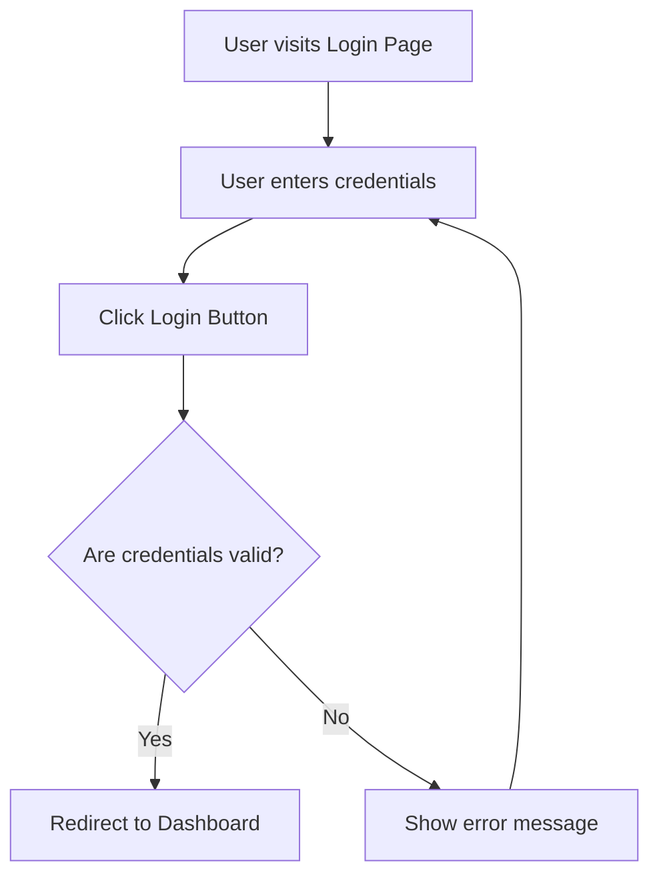
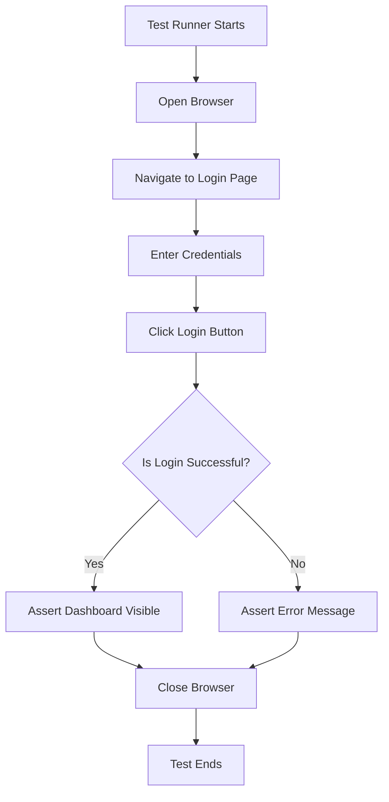

# Login Flow

The following diagram illustrates a typical login flow for a web application:

- **User visits Login Page**: The user navigates to the login page.
- **User enters credentials**: The user inputs their username and password.
- **Click Login Button**: The user submits the login form.
- **Are credentials valid?**: The system checks the credentials.
  - If valid, the user is redirected to the dashboard.
  - If invalid, an error message is shown and the user can try again.

# Test Flow Diagram

The following diagram illustrates a typical automated test flow for the login feature:

- **Test Runner Starts**: The automated test begins.
- **Open Browser**: The test opens a browser instance.
- **Navigate to Login Page**: The test navigates to the login page.
- **Enter Credentials**: The test inputs username and password.
- **Click Login Button**: The test submits the login form.
- **Is Login Successful?**: The test checks if login was successful.
  - If yes, asserts that the dashboard is visible.
  - If no, asserts that an error message is shown.
- **Close Browser**: The browser is closed.
- **Test Ends**: The test completes.

